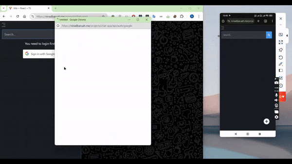

# Real-Time Chat and Video Application

A feature-rich real-time communication platform built with **React.js**, **Node.js**, **MongoDB**, **Cloudinary**, **WebSockets**, and **WebRTC**. This application enables users to connect, send friend requests, exchange real-time messages, make video calls, and more.

## Features

- **User Authentication**: Secure sign-up and login.
- **Friend Management**: Add/remove friends and manage friend requests.
- **Real-Time Messaging**: Send and receive instant messages.
- **Typing Indicator**: Shows when a user is typing.
- **Online Status**: Real-time updates on user online/offline status.
- **Video Calling**: Peer-to-peer video calling using WebRTC.
- **Media Upload**: Upload and share images via Cloudinary.

## Deployment

- Deployed at: [Chat & Video App](https://ninadbaruah.me/projects/chat-app/)


## Demo Video
[](https://ninadbaruah.me/videos/chai-video-app-project.mp4)

Click the image above to watch the video demo.

## Development Environment Limitation

In a local development environment, testing the app with both the caller and receiver on the same device might cause issues. This is because most video input devices (like a webcam) cannot be accessed by two browser instances simultaneously.

## Technologies Used

### Frontend
- React.js
- Tailwind CSS

### Backend
- Node.js
- Express.js
- MongoDB
- WebSockets

### Additional Tools
- Cloudinary (for image uploads)
- WebRTC (for video calls)

## Environment Variables

Create a `.env` file in the root directory and add the following variables:

```plaintext
client_id=your_google_client_id
client_secret=your_google_client_secret
url=your_application_url
mongo_db_uri=your_mongodb_uri
jwt_secret=your_jwt_secret
protocol=http_or_https
frontend_uri=your_frontend_url
backend_url=your_backend_url
NODE_ENV=development_or_production
cloudinary_api_key=your_cloudinary_api_key
cloudinary_secret=your_cloudinary_secret
cloudinary_cloud_name=your_cloudinary_cloud_name
```
## Installation
- Clone the Repository
git clone https://github.com/NinadxBaruah/real-time-chat-and-video.git
cd real-time-chat-app

```

### Install Dependencies

Install backend dependencies:

```
npm install
```

Install frontend dependencies:

```bash
cd client
npm install
```

### Start the Application

Run the backend server:

```bash
npm run dev
```

Run the frontend:

```bash
cd client
npm run dev
```

## Folder Structure

### Backend
- **/routes**: Defines all API routes (e.g., authentication, messaging, video calls).
- **/controllers**: Handles business logic for each route.
- **/models**: Defines MongoDB schemas.
- **/utils**: Contains utility functions (e.g., Cloudinary configuration, JWT handling).

### Frontend
- **/src/components**: Reusable React components (e.g., chat box, video call UI).
- **/src/utils**: Application pages (e.g., login, dashboard).
- **/src/utils**: Custom hooks for WebSocket and WebRTC integration.
- **/src/context**: Context API for global state management (e.g., user details, online status).

## How It Works

1. **Authentication**: Users log in using their credentials, with secure token-based authentication.
2. **Friend Requests**: Users can send, accept, or reject friend requests.
3. **Messaging**: Messages are transmitted in real-time using WebSockets.
4. **Typing Indicator**: Shows when the other user is typing.
5. **Online Status**: Tracks user activity and updates the status dynamically.
6. **Video Calling**: Sets up peer-to-peer connections using WebRTC.

## Contributing

1. Fork the repository.
2. Create a feature branch: `git checkout -b feature-name`.
3. Commit your changes: `git commit -m 'Add new feature'`.
4. Push to the branch: `git push origin feature-name`.
5. Submit a pull request.

## License

This project is licensed under the MIT License. See the [LICENSE](LICENSE) file for details.

---

Built with ❤️ by [Ninad Baruah](https://ninadbaruah.me)
